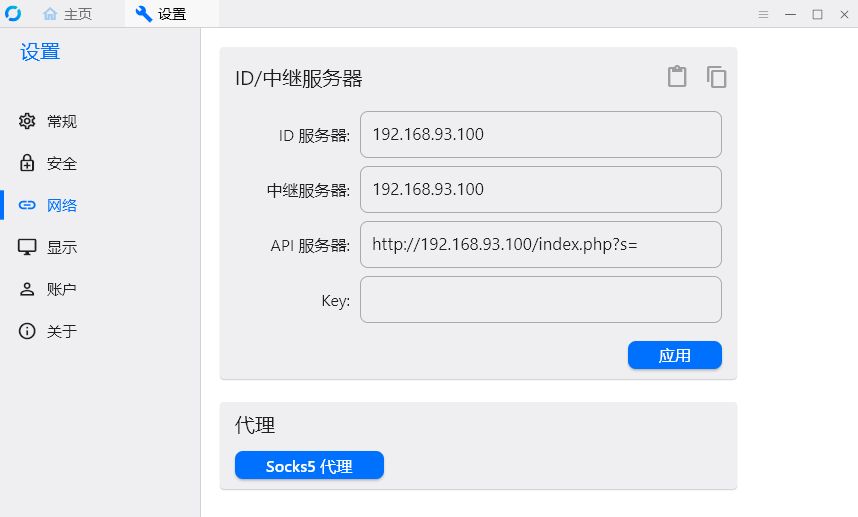

# rustdesk-api
rustdesk远控软件自建API服务器，rustdesk地址薄服务接口，自己架设后，可以方便的管理自己设备ID以及密码

感谢[rustdesk](https://github.com/rustdesk/rustdesk/releases/) 提供这么好的软件，更多详情请关注[rustdesk](https://github.com/rustdesk)。

# 优点：
- 不用记哪些烦人的ID了
- 新增，可以一键登录，设备连接密码也存到服务器上了
- 可以看设备状态

# 新增或修改
- 支持rustdesk 1.2.3，支持用户组
- 增加Docker部署
- 用户的添加和删除，方法见下面食用方法
- 新增mysql版本的api
- 修改sqlite版设备连接密码的更新


# 食用方法
1. 在php环境的服务器上新增一个网站。
2. 把数据库对应的版本的php文件拷贝到根目录。如：SQLite版的在``` sqlite ```文件夹下
3. 在客户端ID/中继服务器里设置API服务器为：http://你到域名或IP:端口/index.php?s=
   ```
    如：http://192.168.0.1/index.php?s=
   ```
4. 首次运行先访问http://你到域名或IP:端口/index.php?ac=runonce 创建数据库以及用户名密码。（mysql版本没有此方法，自行执行mysql脚本）
   ```
   如：http://www.youdomain.com/index.php?ac=runonce
   ```
6. 默认的登录用户名和密码都是：``` admin ```
7. 新增用户方法：http://你到域名或IP:端口/index.php?ac=add&u=[用户名]&p=[密码]，如：需要添加用户名为：test,密码为：123456 则：
   ```
   http://www.youdomain.com/index.php?ac=add&u=test&p=123456
   ```
8. 删除用户方法：http://你到域名或IP:端口/index.php?ac=del&u=[用户名]&p=[密码]，如：需要删除用户名为：test,密码为：123456 则：
   ```
   http://www.youdomain.com/index.php?ac=del&u=test&p=123456
   ```
   注：删除用户会删除用户以前添加的设备ID及信息
   
# Doceker镜像部署
由于刚学的docker，镜像做的不是很到位，但是经过测试没有问题了，容器暴露端口为9001，可以根据自己服务器实际情况开放宿主机的端口，如下面命令就是把宿主机的端口8000映射到容器的9001，为了持久化数据库或使用原来的数据库，所以加了VOLUME：/var/www/data，在创建容器是必须传入这个，这个是/www/rustdesk/data是你宿主机的sqlite数据库目录,他是意思就是把宿主机目录/www/rustdesk/data挂载到容器的目录/var/www/data，而且是固定的，--name 是给容器取了个名字，0.0.1这个tag不知道为啥不能去掉，官方文档说默认是latest，我为啥不能用，有知道怎么搞的，可以给我说一下，下一版本在优化。
   ```
   docker run -p 8000:9001 -d --name rustdesk -v /www/rustdesk/data:/var/www/data --privileged=true v5star/rustdesk-api:0.0.1
   ```
   注：使用docker部署的，在客户端api里填http://ip:port 即可(见下图)。如：你的宿主机IP为192.168.0.10，开发端口为81，那么你的就一直填：
   ```
   http://192.168.0.10:81
   ```
   若使用上面命令不改动的话，就是 
   ```
   http://192.168.0.10:8000
   ```
   第一次执行上面命令会报Unable to find image 'v5star/rustdesk-api:0.0.1' locally，请勿担心，等一会就自动下载并部署完成了。





# 已知BUG
- 网络里设置KEY (id_ed25519.pub),即填写那个公钥字符串后，连接远程设备，需要等很长时间，不填这个串，就秒连了，起作用就是就是加密连接，不填会显示一个红叉，不影响使用。（上面第一张图里的Key那里空着就行）
- 简化版的宝塔或者windows版本的宝塔，默认不能一次执行多条sql语句（请自行解决，或者拆分一条一条的执行）

# 客户端下载
   https://github.com/rustdesk/rustdesk/releases/

## 致谢
- [rustdesk](https://github.com/rustdesk)
